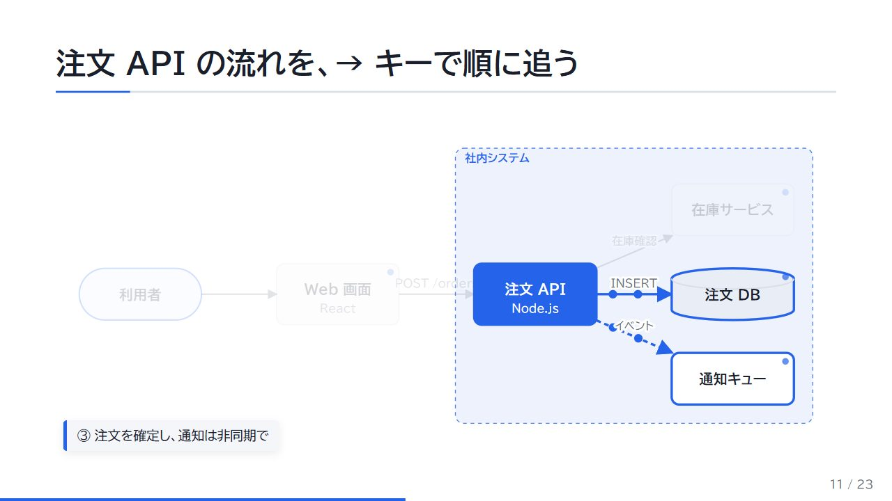
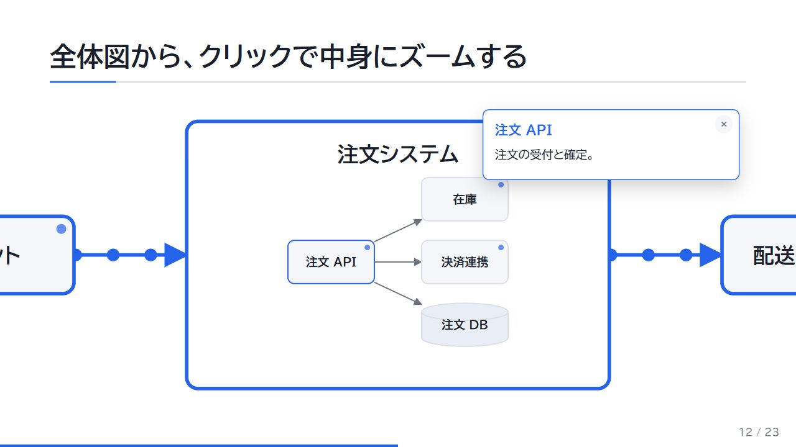
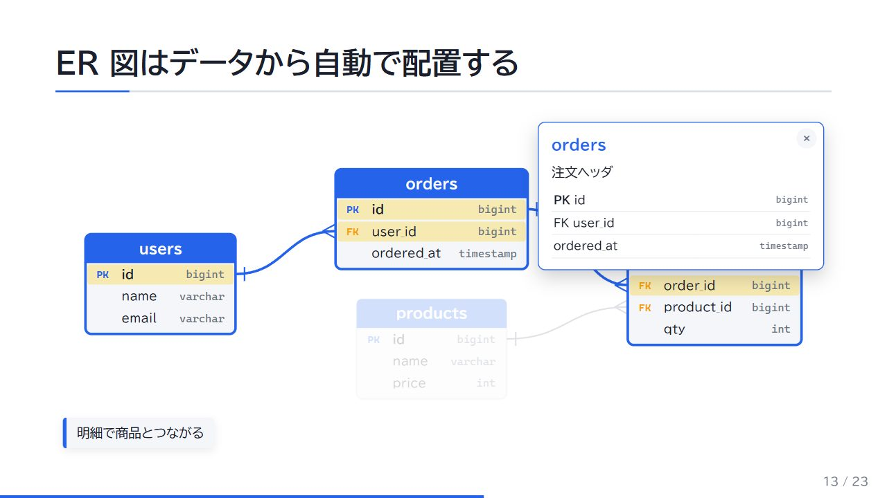
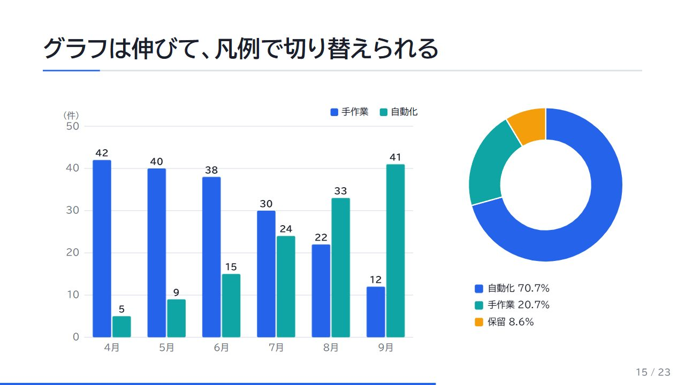
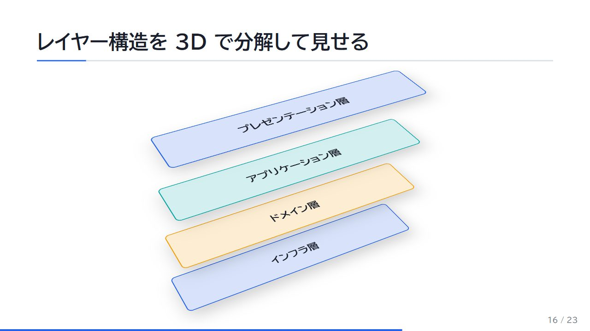
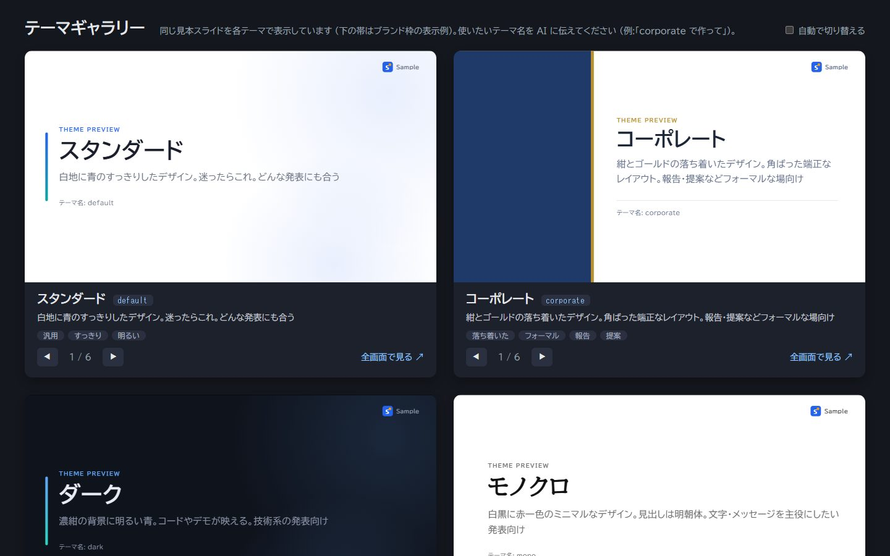
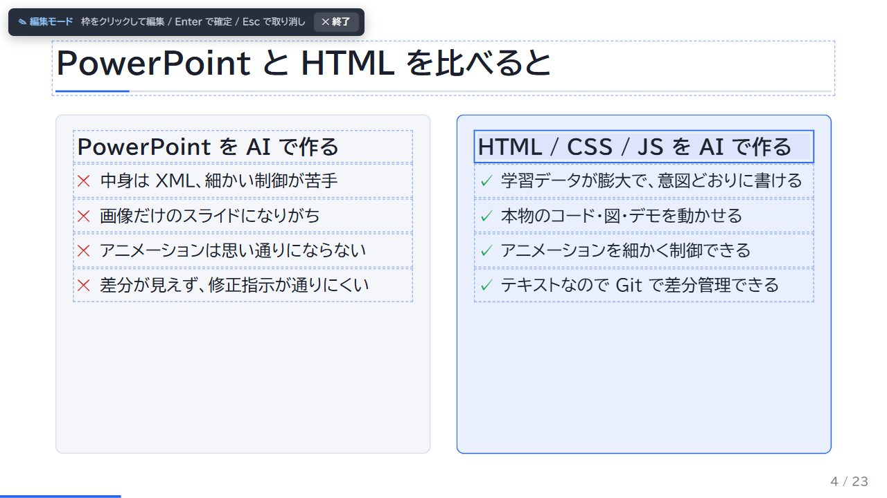

# jh-presentation

[](https://github.com/pei-jz/jh-presentation/actions/workflows/ci.yml)
[](LICENSE)

**Let AI build your presentations as real web pages.**
jh-presentation is an MCP server plus a small, dependency-free slide engine. Your AI client (Claude Desktop, Claude Code, VS Code, …) writes the content; jh-presentation turns it into a **single self-contained HTML file** with live diagrams, step-by-step animation, in-place editing and PDF export — and lets the AI check its own work with layout audits and screenshots.

No API key is needed: the thinking is done by the AI client you already use.

[日本語の説明はこちら](#日本語)



## Why HTML instead of PowerPoint?

AI models are far better at writing HTML/CSS/JS than at driving PPTX. That makes things possible that slide tools struggle with:

- Diagrams that **build up step by step**, with data flowing along the arrows
- A system overview you can **click to zoom into**, revealing the parts inside
- **ER diagrams** and **sequence diagrams** generated from data
- Charts that animate, code that highlights line by line, demos that actually run
- Everything in **one HTML file** that works offline — mail it, put it on a share, present from a browser

| | |
|---|---|
|  |  |
| Click a box to zoom into its internals | Click a table to highlight its relations and join keys |
|  |  |
| Charts with grow animation and legend toggles | Layered architecture exploded in 3D |

## Features

- **Single-file decks** — engine, theme, brand and images are embedded. No build step, no CDN, works from `file://`
- **Diagram components (data in, motion out)** — flow diagrams / zoom maps, ER diagrams, sequence diagrams, charts (bar, line, pie, donut), 3D layer stacks, before/after sliders, terminal replays. The AI writes JSON; layout, animation, clicks and the static PDF view are handled for you
- **Steps** — arrow keys reveal content one step at a time; components hook into the same steps
- **Themes** — five built-in themes (default, dark, corporate, pop, mono), a live theme gallery, and AI-generated custom themes
- **Branding** — your name, logo and a label (e.g. DRAFT) in a header/footer band
- **Self-checking AI** — `audit_deck` detects overflow, clipping, overlapping text, low contrast, missing images and external requests; `screenshot_deck` returns slide images so the AI can look and fix
- **Edit without AI** — double-click any text box to edit it in place, press Ctrl+S to save straight back to the file (only the edited text is replaced)
- **Presenting** — presenter view with notes, next slide and timer; overview; blackout; fullscreen window
- **Safe saving** — atomic writes, revision checks against concurrent edits, 20-version history with restore
- **Request templates** — tech talk, lightning talk, progress report, tech proposal (as MCP prompts)



## Requirements

- Node.js 20 or later
- Google Chrome or Microsoft Edge (used for audits, screenshots and PDF export; set `CHROME_PATH` if it is installed somewhere unusual)

## Quick start

### Claude Desktop

Open **Settings → Developer → Edit Config** and add:

```json
{
  "mcpServers": {
    "jh-presentation": {
      "command": "npx",
      "args": ["-y", "jh-presentation"],
      "env": { "JH_PRESENTATION_HOME": "C:/Users/you/Documents/decks" }
    }
  }
}
```

Quit Claude Desktop from the tray icon and start it again. Then ask, for example:

> Make a 15-minute deck explaining Git branching strategies, with diagrams and step-by-step reveals.

### Claude Code

```bash
claude mcp add jh-presentation -e JH_PRESENTATION_HOME=~/decks -- npx -y jh-presentation
```

### VS Code (`.vscode/mcp.json`)

```json
{
  "servers": {
    "jh-presentation": {
      "command": "npx",
      "args": ["-y", "jh-presentation"],
      "env": { "JH_PRESENTATION_HOME": "${userHome}/Documents/decks" }
    }
  }
}
```

Where decks go, decided per call — no need to change the MCP settings to save somewhere else:

1. the `dir` a tool is given ("make it in this project's slides folder"),
2. the `decks/` folder of the AI client's current workspace (Claude Code, VS Code and other clients that report MCP roots),
3. the workspace: `JH_PRESENTATION_HOME` (default `~/jh-presentation`) or `--workspace <dir>`, for clients without one (Claude Desktop).

The workspace also holds the brand, custom themes and request templates shared by every project; a project's own `brand/` or `themes/` folder wins.
`--decks-dir <name>` (`JH_PRESENTATION_DECKS_DIR`) renames `decks/`, and `--no-roots` (`JH_PRESENTATION_ROOTS=off`) always saves to the workspace.

## What the AI can do (MCP tools)

| Area | Tools |
|---|---|
| Guide | `get_guide` — authoring rules, component catalog, workflow |
| Themes | `list_themes`, `open_theme_gallery`, `preview_themes`, `get_theme_guide`, `create_theme` |
| Templates | `list_templates` (also exposed as MCP prompts) |
| Decks | `list_decks`, `create_deck`, `read_deck`, `write_deck`, `replace_slide`, `add_asset`, `upgrade_deck`, `list_history`, `restore_history`, `repair_deck` |
| Checking | `audit_deck`, `screenshot_deck` |
| Output | `open_deck` (optionally fullscreen), `export_deck` (PDF) |

## Presenting

| Key | Action |
|---|---|
| → / Space / Enter | Next (including steps) |
| ← | Previous |
| S | Presenter view (notes, next slide, timer) |
| E / double-click a box | Edit text in place (Ctrl+S saves, Esc or "✕" exits) |
| O | Overview |
| F | Fullscreen |
| B | Blackout |
| number + Enter | Jump to slide |
| ? | Help |

> Do not use the browser's "Save page as…" — it saves the rendered page and breaks the deck. Use Ctrl+S inside the deck. If it happens anyway, `repair_deck` restores it.



## Working in this repository

```bash
npm install
npm run dev        # http://localhost:4000 — deck list, theme gallery, feature sample
npm test
```

| Command | Description |
|---|---|
| `npm run dev` | Preview server with live reload (local only, 127.0.0.1) |
| `npm run new -- <name> "Title" [--theme <t>] [--brand footer] [--fullscreen]` | New deck in `decks/` |
| `npm run upgrade [-- <name>]` | Re-embed the latest engine, theme and brand |
| `npm run pdf -- <name>` | Export a PDF to `dist/` |
| `npm run repair -- <name>` | Repair a deck broken by the browser's "Save page as" |
| `npm run gallery` | Build the theme gallery |
| `npm run mcp` | Start the MCP server (workspace `.workspace/`) |

The feature sample is [`examples/sample.html`](examples/sample.html). Rules for AI authors live in [`CLAUDE.md`](CLAUDE.md) (Claude Code), [`AGENTS.md`](AGENTS.md) (Codex, Cursor and other agents) and [`docs/authoring-guide.md`](docs/authoring-guide.md); the edit protocol for host applications is in [`docs/edit-protocol.md`](docs/edit-protocol.md).

> The authoring guide, templates and tool descriptions are currently written in Japanese. LLMs follow them fine whatever language you chat in, and decks can be in any language.

## Security

Everything runs on your machine: no telemetry, no outbound requests, the preview/save server binds to 127.0.0.1 only, and files are written only inside the workspace. Decks contain JavaScript written by your AI client and run in your browser. See [SECURITY.md](SECURITY.md).

## License

[MIT](LICENSE). Every deck carries the MIT notice for the embedded engine, components and themes in its generated section, so decks can be shared as-is. The content of your slides is yours.

---

## 日本語

**AI にプレゼンを「Web ページ」として作らせる MCP サーバー**です。Claude Desktop・Claude Code・VS Code などの AI クライアントが内容を書き、jh-presentation が**1 ファイルの HTML デッキ**にします。動く図・段階表示・その場での文字編集・PDF 出力に対応し、AI は検査とスクリーンショットで自分の出来を確認して直せます。API キーは不要です (考えるのは普段使っている AI クライアント)。

- **動く図の部品**: 関連図・ズームマップ・ER 図・シーケンス図・グラフ・3D 分解図・ビフォー・アフター・ターミナル再生 (AI は JSON を書くだけ)
- **テーマ 5 種 + 自作テーマ**、**名前・ロゴの帯**、**依頼文テンプレート** (技術解説・LT・進捗報告・技術提案)
- **枠をダブルクリックして文字を直し、Ctrl+S で元のファイルに保存** (ブラウザの「名前を付けて保存」は使わない)
- **発表者ビュー・一覧・全画面**、保存履歴と復元、壊れたデッキの復旧

### 使い方 (Claude Desktop)

設定 → 開発者 → 「構成を編集」で次を追加し、タスクトレイから終了して再起動します。

```json
{
  "mcpServers": {
    "jh-presentation": {
      "command": "npx",
      "args": ["-y", "jh-presentation"],
      "env": { "JH_PRESENTATION_HOME": "C:/Users/you/Documents/decks" }
    }
  }
}
```

あとは「jh-presentation で、Git のブランチ戦略を 15 分で説明するプレゼン資料を、図とステップ表示を多めに作って」のように頼むだけです。
依頼の書き方 (道具の名前を書くべきクライアント・依頼文に入れるとよいこと・直し方) は [docs/usage.md](docs/usage.md) にまとめています。
詳しい設定 (Claude Code・VS Code) は [mcp/README.md](mcp/README.md) を参照してください。
このリポジトリで AI に作業させる場合のルールは [CLAUDE.md](CLAUDE.md) (Claude Code) / [AGENTS.md](AGENTS.md) (Codex・Cursor など)、スライドの書き方は [docs/authoring-guide.md](docs/authoring-guide.md) にあります。

ライセンスは [MIT](LICENSE) です。デッキには埋め込んだエンジン・部品・テーマの MIT 表記が自動で入るので、そのまま配布できます。スライドの内容は作成者のものです。
